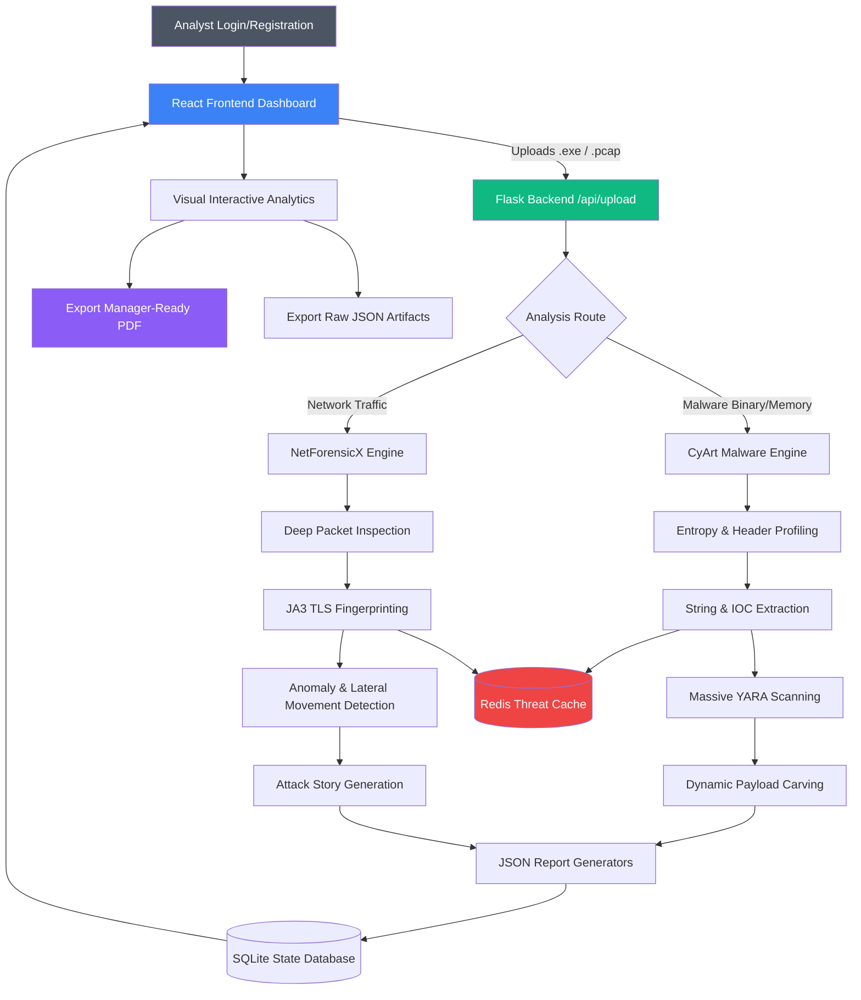

# VigilCore Forensics Platform

**VigilCore** is an enterprise-grade, comprehensive cybersecurity analysis platform featuring high-fidelity Network and Malware Forensic pipelines. Designed for Security Operations Centers (SOC) and Incident Response teams, it provides real-time threat detection, advanced telemetry correlation, and professional intelligence-driven dashboards.

The platform bridges the gap between raw, complex forensic artifacts and manager-ready, actionable intelligence through an intuitive React-based Command Center.

---

## 🚀 Core Forensic Pipelines in Detail

To provide unparalleled visibility into cyber threats, VigilCore employs two highly specialized forensic engines.

### 1. Malware Forensics Pipeline (CyArt Malware)
The Malware Forensics engine is a deeply optimized, multi-stage static and dynamic analysis pipeline designed to tear apart suspicious files, binaries, scripts, and memory dumps to uncover malicious intent.

**What it scans and extracts in detail:**
* **Deep File Profiling & Entropy Analysis:** Calculates Shannon entropy across file sections to detect packed, obfuscated, or encrypted payloads. Extracts rich metadata, PE/ELF headers, imported/exported APIs, and compilation timestamps.
* **Intelligent IOC Extraction:** Recursively scrapes embedded strings, decoded buffers, and configurations to extract hardcoded IP addresses, malicious domains, URLs, and registry keys used by the malware for Command and Control (C2).
* **Massive YARA Signature Matching:** Cross-references the entire file structure, as well as carved memory segments, against thousands of enterprise-grade YARA rules to identify known malware families (e.g., Ransomware, RATs, Emotet, Cobalt Strike).
* **Dynamic Payload Carving:** Automatically identifies and extracts hidden MZ/PE executables, injected shellcode stubs, and encrypted ZIP archives hidden within the parent file or memory dump.
* **Cryptographic Hashing & Fingerprinting:** Generates MD5, SHA-1, SHA-256, and fuzzy hashes (SSDEEP) for immediate cross-referencing with global threat databases.

### 2. Network Forensics Pipeline (NetForensicX)
The Network Forensics engine is a massive-scale PCAP (Packet Capture) analysis system capable of processing gigabytes of network traffic natively without crashing the host system. It reconstructs the entire network narrative of an attack.

**What it scans and extracts in detail:**
* **Deep Packet Inspection (DPI) & Protocol Dissection:** Deconstructs packets across the OSI model. Analyzes HTTP/HTTPS requests, DNS queries, FTP transfers, SMB lateral movement, and SSH connections to map the attacker's footprint.
* **Encrypted Traffic Analysis & JA3 Fingerprinting:** Identifies malicious encrypted communications without needing decryption keys by using TLS/SSL JA3/JA3S fingerprinting to spot known malicious client applications communicating with C2 servers.
* **High-Severity Incident Generation:** Detects network anomalies, brute-force attempts, port scans, and exploitation patterns. Flags these as actionable high-severity incidents with exact timestamps, source, and destination endpoints.
* **Automated Cyber Kill Chain "Attack Story":** Synthesizes thousands of raw packets into a cohesive, human-readable narrative. It automatically explains how the attacker breached the perimeter, what internal assets they moved laterally to, and what data they attempted to exfiltrate.
* **Host Risk Profiling:** Profiles every internal IP address observed in the traffic, assigning an "Infection Risk Score" and labeling compromised assets (e.g., "Patient Zero").

---

## 🛠️ Technology Stack
* **Frontend Command Center**: React.js, Tailwind CSS, Recharts, Vite (for dynamic UI routing and real-time visualization).
* **Backend Engine**: Python 3, Flask (REST API, Asynchronous Subprocess Management).
* **State & Caching Architecture**: 
  * **Redis**: Used as an incredibly fast, O(1) in-memory caching layer for Threat Intelligence. It instantly remembers previously analyzed IPs and Hashes, drastically reducing API rate limits and dropping scan times from hours to minutes.
  * **SQLite**: Used for chunked, large-scale data streaming, ensuring 20GB+ PCAPs don't overflow system RAM.

---

## 📂 Supported File Ingestion

You can upload specific file types via the dashboard depending on the analysis you want to perform:

- **CyArt Malware Pipeline**: `.exe`, `.dll`, `.bin`, `.sh`, `.py`, `.bat`, `.vbs`, and raw memory dumps (`.mem`, `.mddramimage`).
- **NetForensicX Pipeline**: `.pcap`, `.pcapng` capture files.

---

## 🔑 API Keys (Zero-Configuration)
**NO API KEYS ARE REQUIRED** to use the core functionality of VigilCore. The platform operates perfectly out-of-the-box natively and autonomously. While the codebase is structured to support external Threat Intelligence platforms (like VirusTotal or AlienVault), the core forensic analysis, payload extraction, and YARA matching run entirely locally without requiring any paid subscriptions or keys.

---

## ⚡ Resolving Server & Redis Issues

Because VigilCore relies on **Redis** for ultra-fast performance, the Redis server must be running. If the platform fails to start or the dashboard shows backend errors (e.g., "Connection Refused", "Pipeline Failed"), the Redis service is likely inactive.

**How to resolve Redis issues:**
Open your terminal and run the following commands to start and verify Redis:
```bash
# Start the Redis Server
sudo systemctl start redis-server

# (Optional) Enable Redis to start automatically on system boot
sudo systemctl enable redis-server

# Check that Redis is running (should say "active (running)")
sudo systemctl status redis-server
```

---

## ⚙️ Detailed Operational Workflow (How to Use)

Follow these exact steps to deploy and utilize the VigilCore platform from start to finish.

### Prerequisites
1. **Python 3.10+**
2. **Node.js 18+** 
3. **Redis Server**
4. **System Build Dependencies** (Required for forensic packages and Redis):
   ```bash
   sudo apt-get update
   sudo apt-get install -y build-essential libfuzzy-dev python3-dev redis-server
   ```

### Phase 1: Installation & Setup
1. **Clone the Repository**:
   ```bash
   git clone https://github.com/yourusername/Vigil-Core.git
   cd Vigil-Core
   ```
2. **Setup Python Virtual Environment**:
   ```bash
   python3 -m venv env
   source env/bin/activate
   pip install -r requirements.txt
   ```
3. **Setup Frontend Dependencies**:
   ```bash
   cd frontend
   npm install
   cd ..
   ```
4. **Ensure Redis is Active**:
   ```bash
   sudo systemctl start redis-server
   ```

### Phase 2: Launch the Platform
Use the unified launcher to start both the Python backend and React frontend simultaneously:
```bash
python3 run_platform.py
```
- The unified **VigilCore Command Center** will be accessible at: **`http://localhost:5000`** (or `http://127.0.0.1:5000`).
- Note: This launcher automatically builds the production frontend (`npm run build`) and serves it via the Flask backend natively, meaning you do not need to run a separate Node server.

### Phase 3: Platform Operation & Analysis
1. **Authentication (Login/Registration)**: 
   - Upon accessing `http://localhost:5000`, you will be greeted by the secure Authentication portal.
   - **Register** a new analyst account, or **Login** with your existing credentials to access the SOC Dashboard.
2. **Navigate the Command Center**: 
   - Once logged in, use the sidebar to select your desired forensic module: **Malware Forensics** or **Network Forensics**.
3. **Ingest Evidence**: 
   - Click the upload area to select your evidence file (e.g., a suspicious `.exe` or a captured `.pcap`).
4. **Initiate Pipeline**: 
   - Click the **Launch Forensic Engine** button. You will immediately see live logs streaming directly from the backend as the engines deconstruct the file.
5. **Analyze Manager-Ready Results**: 
   - Once complete, the dashboard will transition to the Results view, populating interactive pie charts, YARA signature matches, IOC tables, and the automated Cyber Kill Chain attack story.
6. **Export Professional Reports**: 
   - Click **Download PDF** to generate a high-resolution, manager-ready report document.
   - Click **Save to Folder** to export the raw, machine-readable JSON artifacts for integration with other SIEM tools.

---

## 🛡️ Architecture & Data Flow Diagram

The following diagram illustrates exactly how evidence moves through the VigilCore ecosystem:



---

## 📜 License
This is an open-source project released under the **MIT License**. You are free to use, modify, and distribute this software for educational, research, and commercial purposes. Contributions and pull requests are highly encouraged!
